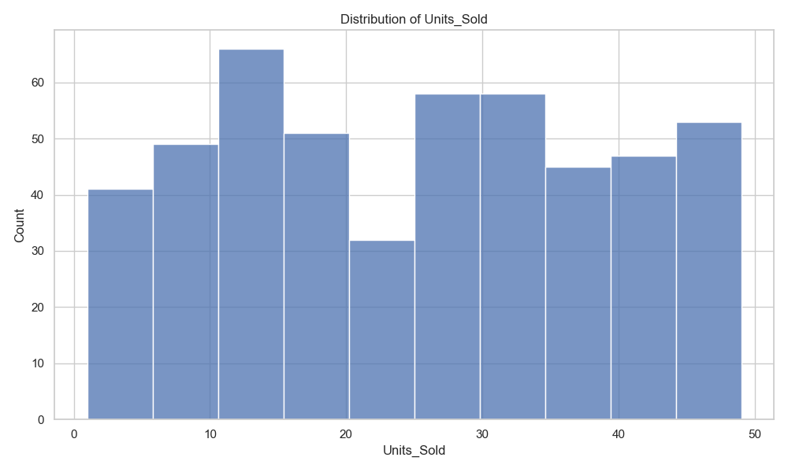
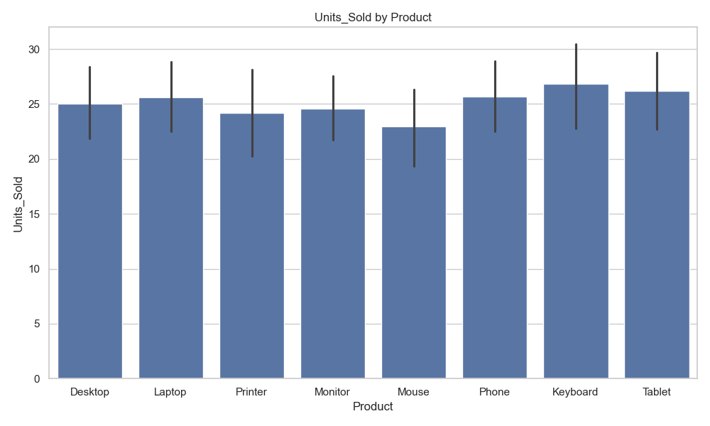

# Data Analysis Report

**Author:** Data Analysis Agent  
**Generated:** 2025-05-24 00:02:06  

## Executive Summary

Analysis of the provided data file.

## Data Overview

This report analyzes data from 'sales_data.xlsx'. The dataset contains 500 rows and 8 columns.

**Table: Dataset Summary**

| Attribute | Value |
| --- | --- |
| File | sales_data.xlsx |
| Rows | 500 |
| Columns | 8 |
| Missing Values | 0 |

### Column Information

**Numeric columns (5)**: Units_Sold, Unit_Price, Customer_Rating, Discount_Applied, Revenue

**Categorical columns (2)**: Product, Region

**Datetime columns (1)**: Date

## Key Findings

Key findings from the analysis:

1. The data shows several patterns that may be worth investigating.

2. There are some potential correlations between variables.

3. Some data points exhibit unusual characteristics.

## Data Visualizations

Basic visualizations to understand data distribution.

**Figure: Distribution of Units_Sold**

*This visualization shows patterns in the data.*

**Figure: Units_Sold by Product**

*This visualization shows patterns in the data.*

## Recommendations

Based on the analysis, we recommend:

1. Consider deeper analysis of specific variables.

2. Investigate potential correlations identified.

3. Clean data where missing values were detected.

## Conclusion

The analysis provides a foundation for understanding the dataset.

